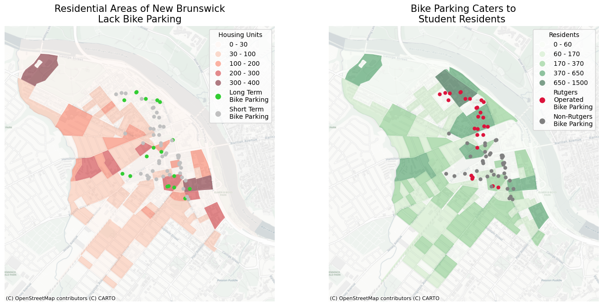
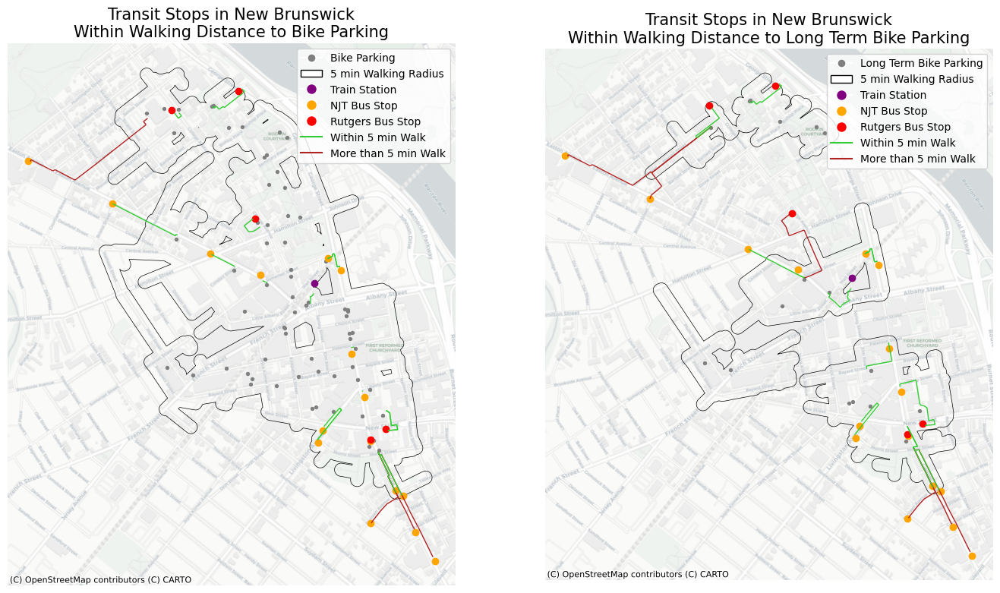

## New Brunswick Bike Parking Inventory

This is Eric Yang's Final Project for Fall 2025 Command Line GIS:
An inventory of downtown New Brunswick's bike parking

I collected the bike parking data myself in a field audit, the demographic data is from the 2020 Census and the transit stop locations are from NJGIN.

I used Folium to create an interactive map of the bike parking locations I documented. Click on each bike rack for more information!
<iframe src="webmap.html" height="925" width="925"></iframe>
The bike rack icons are by Lluisa Iborra from Noun Project

I filtered the Census shapefile by county and tract to focus on the New Brunswick area. I used the 2020 Decennial Census so the numbers were not estimates.
Student housing was not counted in the housing units data, but student residents were counted in the population data.

I clipped the NJGIN transit stop data (bus and rail) using the filtered Census shapefile to get the New Brunswick stops. I used OSMnx to create five minute walking buffers for each bike parking location, and combined them to create a five minute walkshed of the bike parking network.

I also used a spatial join to connect each transit stop to the nearest bike parking location (and nearest long-term bike parking location). I used OSMnx to map the fastest route between these points. In the interactive map, you can click on each transit stop to see the time needed to walk to the nearest bike parking location. 

